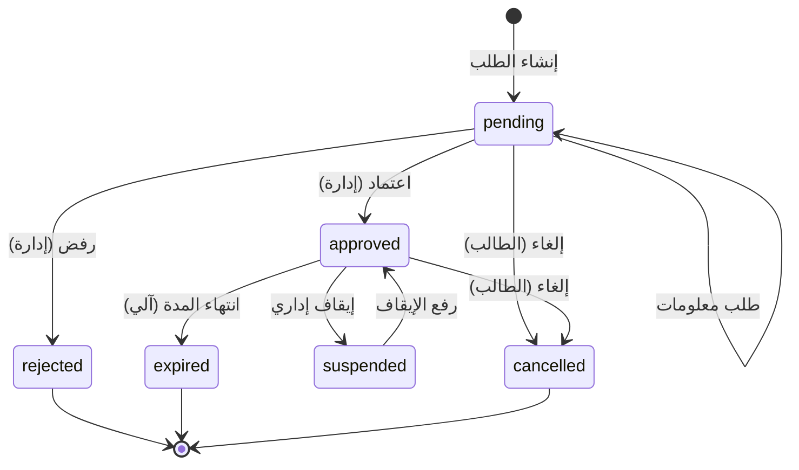
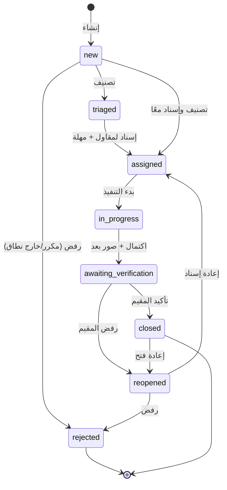
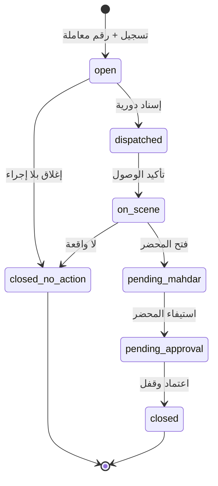
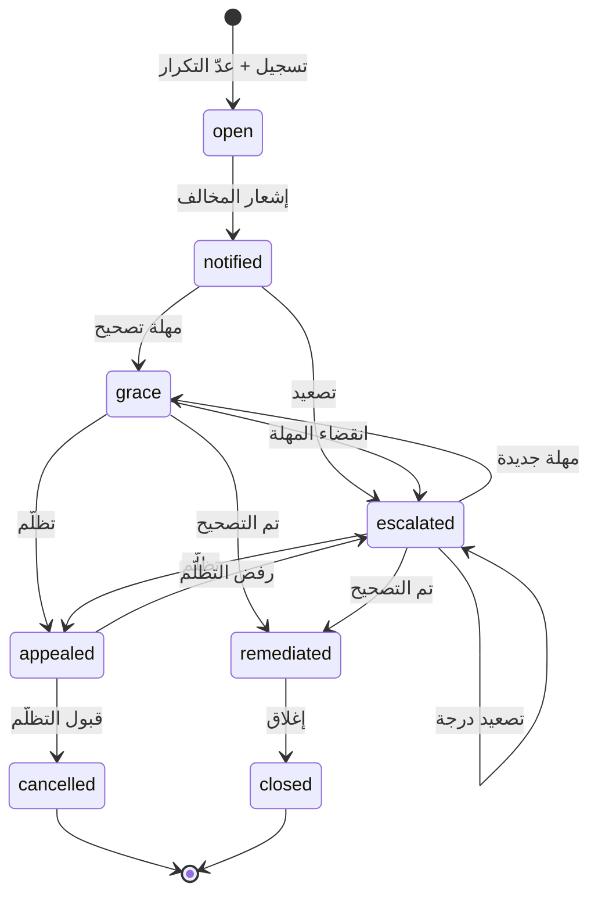
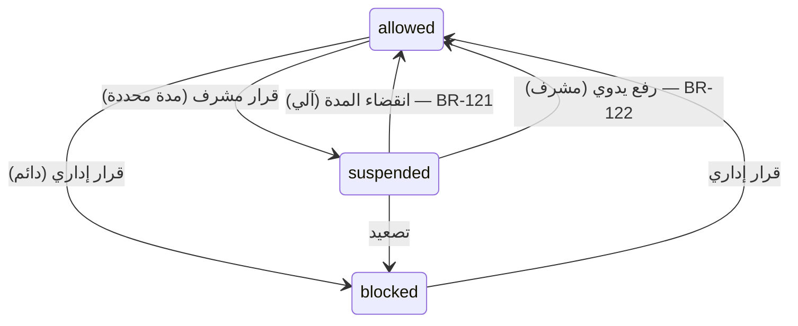
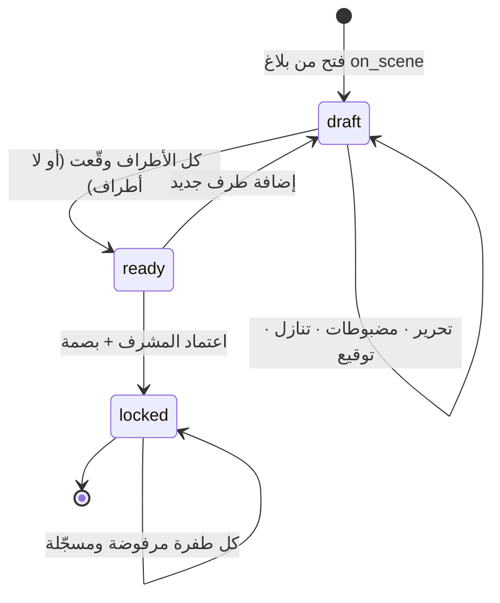

# آلات الحالة — State Machines

`BA` · محلل الأعمال · v1.0

كل كيان له دورة حياة تُنفَّذ عبر `assertTransition()` في [`src/lib/rules.ts`](../../src/lib/rules.ts). الانتقال غير المسموح يرمي `IllegalTransition` ولا يُنفَّذ.

**القاعدة `BR-003`:** لا انتقال حالة خارج الآلة. لا استثناء «داخلي» ولا قفزة «ذرّية».

---

## SM-01 · التصريح — `Permit`



| من ← إلى | الشرط | الفاعل | القاعدة |
|---|---|---|---|
| `— → pending` | حقول النوع مستوفاة، الحد الأقصى غير مُستنفَد | المقيم | `BR-030` `BR-031` |
| `pending → approved` | — | admin_staff | `BR-039` |
| `pending → rejected` | سبب مكتوب | admin_staff | |
| `pending → pending` | طلب معلومات لا يغيّر الحالة | admin_staff | `BR-036` |
| `pending/approved → cancelled` ✨ | صاحب الطلب فقط | المقيم | `BR-038` |
| `approved → expired` | `now > validToISO` — **تلقائي** | النظام | `BR-035` ⚠️✅ |
| `approved → suspended` | سبب مكتوب | admin_staff | `BR-037` |
| `suspended → approved` | — | admin_staff | |

> **التغيير:** `cancelled` و`expired` كانتا معرّفتين في النوع ولا يصلهما شيء. الآن `expired` تُطبَّق آليًا و`cancelled` متاحة للطالب.

---

## SM-02 · البلاغ الخدمي — `ServiceRequest` ⚠️ جديدة كليًا



> **العيب `DEF-010`:** كانت البلاغات **الكيان الوحيد بلا آلة حالة**. التصاريح والمخالفات والحوادث محمية، والبلاغات مكشوفة — أي دالة تُستدعى على أي حالة.
> **العيب `DEF-009`:** `triaged` كانت حالة يتيمة: البذرة تُنشئها، و`triageRequest()` يتخطاها إلى `assigned`، وطابور الإدارة **لا يعرض أي زر** لها. عالقة للأبد.
> **الحل:** آلة كاملة تعترف بـ`triaged` كحالة شرعية بمسار خروج، وتضيف `rejected` (`BR-058`).

| من ← إلى | الشرط | الفاعل |
|---|---|---|
| `— → new` | وصف مكتوب | أي شخصية / مستشعر |
| `new → triaged` | تصنيف بلا إسناد بعد | admin_staff |
| `new/triaged → assigned` | جهة منفذة + مهلة من جدول SLA | admin_staff |
| `assigned → in_progress` | — | المقاول |
| `in_progress → awaiting_verification` | **صور «بعد» مرفوعة** | المقاول |
| `awaiting_verification → closed` | تأكيد صاحب البلاغ | المقيم |
| `awaiting_verification/closed → reopened` | سبب مكتوب | المقيم |
| `reopened → assigned` | — | admin_staff |
| `new/reopened → rejected` ✨ | سبب مكتوب يظهر للمبلّغ | admin_staff |

**حدث عرضي:** `now > dueISO` ⇒ `slaBreached = true` + إشعار للمسؤول. لا يغيّر الحالة. (`BR-054`)

---

## SM-03 · البلاغ الأمني — `Incident`



> **العيب `DEF-019`:** الآلة المعلنة كانت `pending_mahdar → pending_approval → closed`، بينما `approveMahdar()` يكتب `status: 'closed'` مباشرة **متجاوزًا `assertTransition`** بتعليق يعترف: *«يحدث ذرّيًا عند الاعتماد»*. النتيجة: `pending_approval` حالة ميتة، والآلة المعلنة ليست المنفَّذة.
> **الحل:** الاعتماد يمر بالانتقالين صراحة. الحالة تعني الآن شيئًا: «المحضر مستوفى وينتظر المشرف».

| من ← إلى | الشرط | الفاعل | القاعدة |
|---|---|---|---|
| `— → open` | نوع + خطورة + وقت الواقعة + وصف | الحارس/المقيم | `BR-060` `BR-061` |
| `open → dispatched` | دورية **متاحة** | supervisor / آلي للطوارئ | `BR-063` `BR-064` |
| `dispatched → on_scene` | — · يحسب زمن الاستجابة | الحارس | `BR-065` |
| `on_scene → pending_mahdar` | — · تتحرر الدورية | الحارس | `BR-066` `BR-080` |
| `pending_mahdar → pending_approval` | الملخص والتسوية والتوقيعات مستوفاة | الحارس | `BR-084` |
| `pending_approval → closed` | اعتماد المشرف + قفل + بصمة | supervisor | `BR-085` `BR-087` |
| `open/on_scene → closed_no_action` ✨ | قرار مشرف + سبب | supervisor | `BR-072` |

**حدث عرضي:** التصعيد لجهة خارجية (`medical`/`fire`/`traffic_accident`) يُسجَّل في الخط الزمني ولا يغيّر الحالة. (`BR-073`)

---

## SM-04 · المخالفة — `Violation`



| من ← إلى | الشرط | الفاعل | القاعدة |
|---|---|---|---|
| `— → open` | موضوع + رمز + موقع · **يُحسب `repeatCount` بنافذة 12 شهرًا** | حارس/مفتش | `BR-115` |
| `open → notified` | — · يُشعَر المخالف | supervisor/admin | |
| `notified → grace` | عدد أيام من الإعدادات | supervisor/admin | |
| `notified/grace/escalated → escalated` | درجة واحدة، لا تتجاوز آخر السلّم | supervisor/admin | `BR-117` |
| `grace/escalated → appealed` ✨ | تظلّم بسبب · **يوقف عدّاد المهلة** | المخالَف | `BR-123` |
| `appealed → cancelled` ✨ | قبول · **ترفع كل الآثار ولا تُحتسب في التكرار** | supervisor | `BR-124` |
| `appealed → escalated` ✨ | رفض بتسبيب | supervisor | |
| `grace/escalated → remediated` | إثبات التصحيح | supervisor/admin | |
| `remediated → closed` | — | supervisor/admin | |

### الإجراء المتفرّع: إيقاف المركبة

الإيقاف **ليس انتقال حالة** — هو أثر جانبي يكتب على كيان آخر:

```
escalationStep ≥ suspendAtStep − 1
        │
        ▼ قرار مشرف (سبب + مدة)
   ┌────────────────────────────────────┐
   │ vehicle.accessState = 'suspended'  │
   │ vehicle.suspension = { … }         │
   │ violation.escalationStep =          │
   │        settings.suspendAtStep       │  ← كان 5 ثابتًا · DEF-013
   └────────────────────────────────────┘
        │
        ▼
   البوابة ترفض تلقائيًا · BR-101
```

---

## SM-05 · حالة وصول المركبة — `Vehicle.accessState` ✨ جديدة

كانت الحالة الأخطر بلا آلة معلنة. المصدر المباشر لـ`DEF-001`.



| الانتقال | المحفّز | الأثر الكامل |
|---|---|---|
| `allowed → suspended` | قرار مشرف على مخالفة | كتابة `Suspension` + رفع الدرجة + إشعار المالك والأمن + تدقيق |
| **`suspended → allowed` (آلي)** ⚠️ | `now ≥ suspension.untilISO` | **كان غائبًا تمامًا.** الآن: تصحيح الحالة + `liftedAtISO` + حدث في المخالفة + إشعار المالك والأمن + تدقيق |
| `suspended → allowed` (يدوي) | قرار مشرف | نفس ما سبق + **إنهاء أثر المخالفة** (`BR-122`) |
| `→ blocked` | قرار إداري | دائم، لا ينتهي بالزمن (`BR-104`) |

**نقطة التنفيذ:** الفحص يجري **عند القراءة** في `evaluateGate()` وعند كل نبضة مستشعر (كل 3 ثوانٍ) — لا يعتمد على مؤقّت وحيد قد يُفوَّت.

---

## SM-06 · المحضر — `Mahdar`



> **العيب `DEF-003`:** الانتقال `draft → ready` كان `parties.length > 0 && parties.every(signed)`. البلاغ بلا أطراف ⇒ `false` أبدًا ⇒ **لا اعتماد ممكن** ⇒ البلاغ لا يُغلق. وهذا هو المسار الافتراضي لأنواع كثيرة (تجمهر، جسم مشتبه، عطل جهاز).
> **الحل (`BR-084`):** الشرط صار `parties.every(signed)` — والمصفوفة الفارغة تُرجع `true` بحكم المنطق. بلاغ بلا أطراف يعتمده المشرف بإقراره وحده، وهو الصحيح إجرائيًا.

**حالة `locked` امتصاصية بحق:** لا مخرج منها. التصحيح بمحضر جديد يشير للأصل (`BR-088`).

---

## SM-07…SM-09 · آلات مساندة

### SM-07 · الحجز — `Booking`
```
confirmed → cancelled   (إلغاء · مستقبلي فقط · BR-132)
confirmed → used        (استُهلك عند البوابة · BR-133) ⚠️ كان انتقالًا ميتًا · DEF-016
```

### SM-08 · موعد السفارة — `EmbassyAppointment`
```
booked → attended   (دخل عبر البوابة · BR-137)
booked → expired    (انقضى اليوم بلا حضور)
booked → cancelled  (إلغاء)
```
**تنبيه:** حساب الحد اليومي يشمل `booked` **و**`attended` — وإلا تحرّر المقعد بالحضور واختُرق الحد (`BR-136` · `DEF-024`).

### SM-09 · تصريح الزائر — `VisitorPass`
```
paid → used      (أول دخول · إعادة الدخول تبقى مسموحة طوال اليوم · BR-140)
paid → expired   (انقضى يوم الزيارة)
used → expired   (انقضى يوم الزيارة)
```

---

## ملخص التغييرات على آلات الحالة

| الآلة | التغيير |
|---|---|
| `SM-01` التصريح | `expired` صارت آلية · `cancelled` صارت متاحة |
| `SM-02` البلاغ الخدمي | **آلة جديدة كليًا** · `triaged` أُنقذت · `rejected` أُضيفت |
| `SM-03` البلاغ الأمني | `pending_approval` أُحييت · `closed_no_action` أُضيفت |
| `SM-04` المخالفة | `appealed` و`cancelled` أُضيفتا · درجة الإيقاف صارت من الإعدادات |
| `SM-05` حالة المركبة | **آلة جديدة كليًا** · الانتهاء التلقائي أُضيف |
| `SM-06` المحضر | شرط الجاهزية أُصلح (الطريق المسدود) |
| `SM-07` الحجز | `used` أُحييت |
| `SM-08` موعد السفارة | حساب الحد أُصلح |
